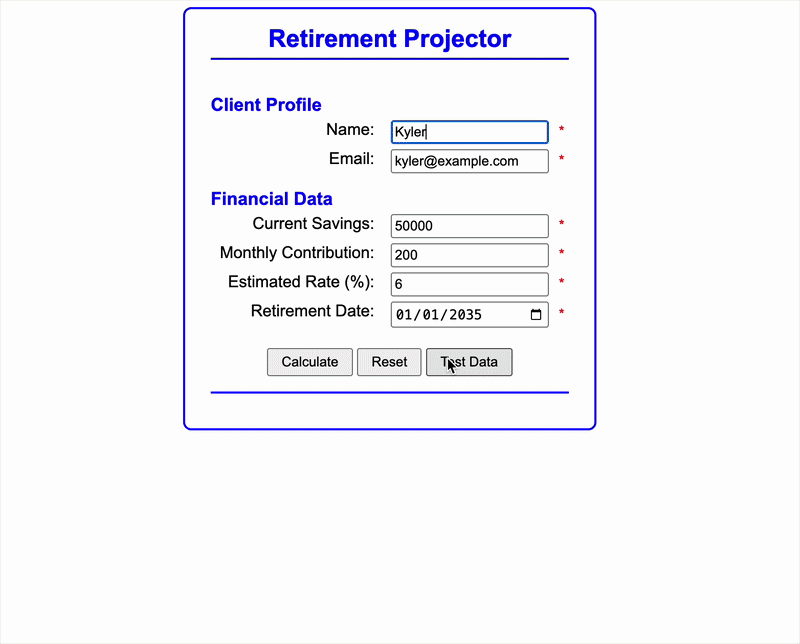

# Retirement Countdown
## Output

## Table of Contents
* [Authors](#authors)
* [Purpose](#purpose)
* [Script Breakdown](#script-breakdown)
* [New Concepts Used](#new-concepts)
* [Output](#output)
* [Credits](#credits)
## Authors

* [Kyler Hanson](https://github.com/kyhans07)
## Purpose

This a program designed to take user input like their balance, monthly additions, 
and isurance rate to calculate earnings based on when they want to retire. This 
runs a projection of the income to help them determine if they are contributing
enough money.

## Script Breakdown
### Important Globals
* `projectionTimer` - The id of the interval object used to calcualte the yearly
  projections
* `formatter` - An IntL number formatter set up to convert a number to US formatted
  currency
### Functions and Listeners
* `processEntries`
* Processes the entries from the form doing data validation and conversions
* If it's valid data it passes this to `startProjection`
* `startProjection`
* Starts an interval object to perform monthly evaluations of what your savings
  account will have after calculating the interest, monthly add-in, and current
  savings
* It will then display that information to the user at the end of a year
* Calculates a new year in one second increments
* `setTestData`
* Loads test data for easier testing
* `resetForm`
* resets the form data and sets program to its initial state
* `document.onDOMContentLoaded`
* Adds event listeners which calls the relevant functions
* `setLocalStorage`
* Takes data and saves it to local storage
* Only valid inputs
* `getLocalStorage`
* Pulls any information about previous inputs and puts them in the inputs when
  the page is loaded
* Pulls the info from local storage
##  Concepts
* Input Date Manipulation
* Intervals
* Data Validation
* Error Handling + Warnings
Money Formatting
* Local Storage manipulation
